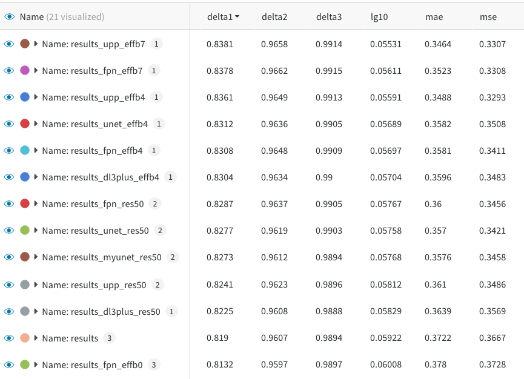

# Monocular Depth Estimation for [NYU2](https://cs.nyu.edu/~silberman/datasets/nyu_depth_v2.html)
This repository provides a simple PyTorch Lightning implementation of monocular depth estimation for NYU Depth Dataset V2.

## Dependencies

- Docker 20.10.2
- [Docker Compose](https://docs.docker.com/compose/) 1.28.3
- Python 3.8.0
- [Segmentation Models](https://github.com/qubvel/segmentation_models.pytorch) 0.1.3 
- [PyTorch](https://pytorch.org/) 1.6.0
- [PyTorch Lightning](https://www.pytorchlightning.ai/) 1.2.5
- [OmegaConf](https://omegaconf.readthedocs.io/en/2.0_branch/) 2.0.6
- [Weights & Biases](https://wandb.ai/site) 0.10.25

Please see [requirements.txt](./docker/requirements.txt) for the other libraries' versions.

## Approach

Segmentation model + *Depth loss

*We use the three loss proposed in [[J. Hu+, 2019]](https://arxiv.org/abs/1803.08673).




NOTE: To simplify the experiment, we set the image size to [288, 224] (divisible by 32), which is not exactly the same as the evaluation in the paper.

## Preparation

### Dataset: NYU Depth Dataset V2

```bash
sh scripts/prepare_nyu2.sh
```

[This script](./scripts/prepare_nyu2.sh) uses the downloading link in [J. Hu's repository](https://github.com/JunjH/Revisiting_Single_Depth_Estimation).


### Installation

```bash
docker-compose build
docker-compose run dev
```

## Run

### Train
```bash
python tools/train.py
```

```bash
usage: train.py [-h] [--config CONFIG] [--resume RESUME] [--gpu-ids GPU_IDS [GPU_IDS ...] | --n-gpu N_GPU] [--amp {O1,O2,O3}]
                [--profiler {simple,advanced}]
                ...

Train a predictor

positional arguments:
  opts                  Overwrite configs. (ex. OUTPUT_DIR=results, SOLVER.NUM_WORKERS=8)

optional arguments:
  -h, --help            show this help message and exit
  --config CONFIG       Optional config path. `configs/default.yaml` is loaded by default
  --resume RESUME       the checkpoint file to resume from
  --gpu-ids GPU_IDS [GPU_IDS ...]
  --n-gpu N_GPU
  --amp {O1,O2,O3}      amp opt level
  --profiler {simple,advanced}
                        'simple' or 'advanced'
```

If you want to override the config with command line args, put them at the end in the form of dotlist.

```bash
python tools/train.py --config [config path] SOLVER.NUM_WORKERS=8 SOLVER.EPOCH=5
```


## Credit

```
@inproceedings{Hu2019RevisitingSI,
  title={Revisiting Single Image Depth Estimation: Toward Higher Resolution Maps With Accurate Object Boundaries},
  author={Junjie Hu and Mete Ozay and Yan Zhang and Takayuki Okatani},
  journal={2019 IEEE Winter Conference on Applications of Computer Vision (WACV)},
  year={2019}
}
```
